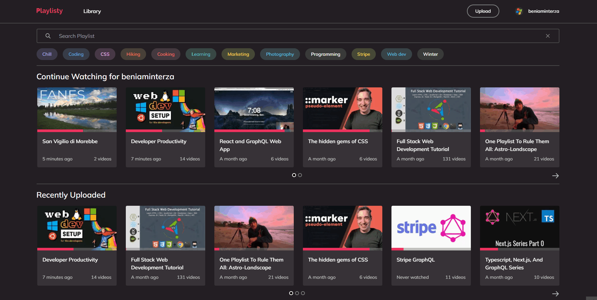

# Playlisty
This project is solving one missing feature of YT, tracking a the YT playlist's watching total watch progress. It is a fullstack projects, it uses a Database to store all the users playlists. By the help of the YT API it can access all the content of the playlist.
[Try it out (Server is slow)](https://playlisty.vercel.app/)
## Features
 - Safe Login with a Github account
 - Uploading/Deleting a YT Playlist
 - Tracks the total watch progress of the playlist
 - Custom labels for playlists
## Examples
### Library

### Watching a playlist

### Order by Labels

### Create new label for playlist

### Note keeper

